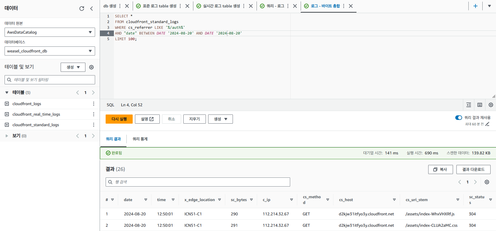
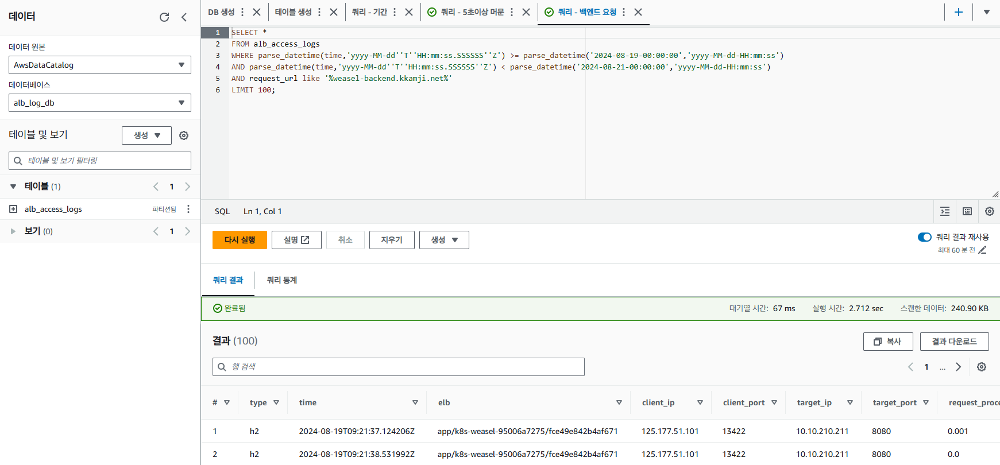
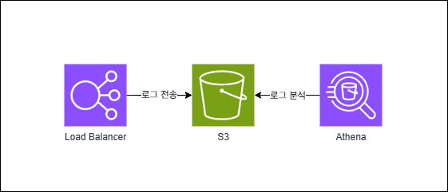

# Weasel 🔥🔥🔥

> Bedrock Claude Sonnet 3.5 Foundation Model 기반 문제 풀이 서비스

## Skill Set

- Backend => Spring Boot
- Frontend => React
- IaC => Terraform
- Deploy => Amazon EKS, S3, Route53, CloudFront
- Container Registry => ECR
- CI/CD => Jenkins, ArgoCD
- AI => AWS Badrock(Claude 3.0 sonnet)
- Monitoring => Prometheus, Grafana

## Infra Architecture

## Bedrock Workflow

## CI/CD Workflow

## Jenkins

## ArgoCD

## Cloudfront Logging

  
  

## Load Balancer Logging

  
  

## 프로젝트 일정 관리

