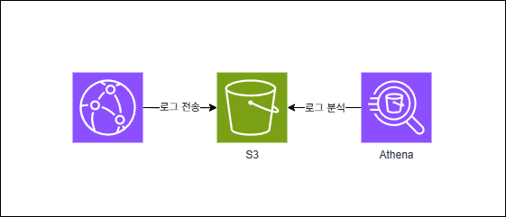

# Weasel 🔥🔥🔥

> Bedrock 기반 문제 풀이 서비스  
> 사용자가 문제에 대한 사진을 캡쳐 후 전송하게되면 문제에 대한 답, 해설 및 각각의 선지가 왜 맞고 왜 틀린지에 대한 내용 제공

## Skill Set

- Backend => Spring Boot
- Frontend => React
- IaC => Terraform
- Deploy => Amazon EKS, S3, Route53, CloudFront
- Container Registry => ECR
- CI/CD => Jenkins, ArgoCD
- AI => AWS Badrock(Claude 3.5 sonnet)
- Monitoring => Prometheus, Grafana
  
## Main

## Login

## 문제 풀이

### 영어 문제

### 한글 문제

## Infra Architecture

## Bedrock Workflow

## CI/CD Workflow

## Jenkins

## ArgoCD

## Cloudfront Logging

  
  

## Load Balancer Logging

  
  

## 프로젝트 일정 관리

